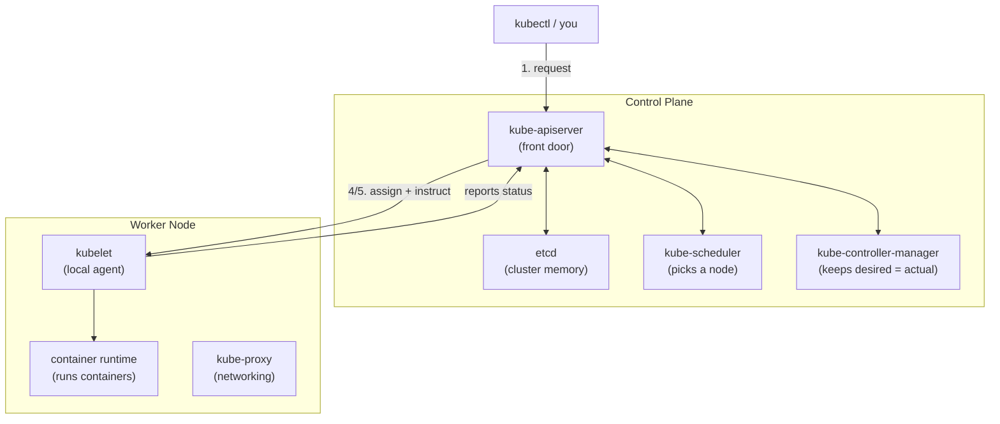

# Cluster Architecture

## The big picture

A Kubernetes **cluster** is a set of machines (called **nodes**) that work together to run your applications. Nodes come in two flavors:

- **Control plane node(s)** — the "brain." Makes decisions: what should run, where it should run, and keeps track of the current state of everything.
- **Worker node(s)** — the "muscle." Actually runs your applications (in containers).

Think of it like a restaurant:
- The **control plane** is the kitchen manager — takes orders, decides which chef cooks what, and keeps a running list of every order's status.
- The **worker nodes** are the chefs — they do the actual cooking (running containers) and report back when a dish is done or something goes wrong.

You never "log in" to a worker node and manually start a container. Instead, you tell the control plane *what you want* (e.g. "run 3 copies of this app"), and the control plane figures out *how* to make that happen across the workers.

## Control plane components

The control plane isn't one thing — it's four components working together, usually all running on the same control plane node(s):

| Component | One-line job |
|---|---|
| **kube-apiserver** | The front door. Every request — from you (`kubectl`), from nodes, from internal components — goes through the API server. Nothing talks directly to `etcd` or to each other; everything goes through here. |
| **etcd** | The memory. A key-value database that stores the entire state of the cluster (what exists, what's running where). If `etcd` is lost, the cluster forgets everything. |
| **kube-scheduler** | The matchmaker. When something new needs to run, the scheduler decides *which worker node* is the best fit (based on resources, constraints, etc.) — it doesn't run anything itself, just picks the node. |
| **kube-controller-manager** | The supervisor. Constantly watches the cluster state and nudges reality toward what you asked for (e.g. "you wanted 3 replicas, only 2 are running — start 1 more"). |

You don't need to know how each of these works internally yet — we'll dedicate a note to each one. For now, just know: **API server is the front door, etcd is the memory, scheduler picks the node, controller-manager keeps reality matching your request.**

## Worker node components

Each worker node runs three things:

| Component | One-line job |
|---|---|
| **kubelet** | The node's local agent. Talks to the API server, receives instructions ("run this container"), and makes sure it actually happens on this node. |
| **container runtime** | The actual engine that runs containers (e.g. containerd). kubelet tells it what to start/stop. |
| **kube-proxy** | Handles networking on the node — makes sure traffic gets routed to the right containers, even as they move around the cluster. |

## How it fits together (a simple flow)

Say you run `kubectl create deployment nginx --image=nginx`:

1. `kubectl` sends that request to the **kube-apiserver**.
2. The API server validates it and writes the desired state ("I want an nginx pod") into **etcd**.
3. The **kube-scheduler** notices a pod needs a home, and picks a suitable worker node.
4. The API server updates etcd with that assignment.
5. The **kubelet** on that chosen worker node notices (via the API server) that it's been assigned a new pod, and tells the **container runtime** to start it.
6. The **kube-controller-manager** keeps watching in the background — if that pod dies, it notices the actual state no longer matches the desired state and triggers a replacement.

## Key idea to remember

Kubernetes is built around **desired state vs. actual state**:

- You declare *desired state* ("I want 3 replicas of nginx running").
- Kubernetes continuously works to make *actual state* match it — and keeps re-checking, forever, even if something crashes or a node dies.

This "keep checking and correcting" loop (called a **reconciliation loop** or **control loop**) is the core idea behind almost everything Kubernetes does. Once this clicks, most other concepts in the course will make a lot more sense.

## Exam tips

- Know which component does what — the CKA loves asking "which component is responsible for X" and also has troubleshooting scenarios where a component is down (e.g. "pods aren't scheduling" → check kube-scheduler; "kubectl commands hang" → check kube-apiserver).
- Control plane components run as **static pods** in `kubeadm`-based clusters — you'll be able to see them with `kubectl get pods -n kube-system`.
- We'll dedicate a note to each component (`etcd.md`, `kube-apiserver.md`, etc.) as we go deeper — this note is just the map of how they all connect.
