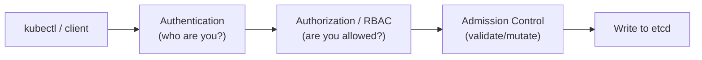

# kube-apiserver

> Builds on: [cluster architecture](./architecture.md) and [etcd](./etcd.md). Read those first if you haven't.

## What it actually is

The **kube-apiserver** is a single binary (a REST API server) that exposes the Kubernetes API over HTTPS. It is the **only** component that talks directly to etcd. Every other component — `kubectl`, the scheduler, the controller-manager, kubelet on every worker node, even other instances of the API server in an HA setup — talks *only* to the API server, never to each other directly and never to etcd directly.

This makes the API server the **single entry point and gatekeeper** for the entire cluster. If it's down, you can't run `kubectl` commands, nothing new can be scheduled, and no component can report status changes — even though already-running pods keep running on their nodes.

## What happens to every request

Every request that hits the API server (e.g. `kubectl apply -f pod.yaml`) passes through a fixed pipeline of stages, in order:

1. **Authentication** — *who are you?* Checks the client certificate, bearer token, or other credentials to identify the caller (a user, or a service account).
2. **Authorization** — *are you allowed to do this?* Usually via **RBAC** (Role-Based Access Control) — checks if the authenticated identity has permission for this specific action on this specific resource.
3. **Admission Control** — *should this be allowed/modified, even if authorized?* A chain of plugins that can validate or mutate the request — e.g. rejecting a pod that doesn't specify resource limits, or auto-injecting a sidecar container.
4. **Validation & persistence** — if it passes all the above, the object is validated against the API schema and written to **etcd**.

Only after a write succeeds in etcd does the API server consider the request complete and respond back to the caller.



## How the other components use it

None of these talk to etcd directly — they all go through the API server:

- **kube-scheduler** watches the API server for pods with no node assigned, decides where they should go, then tells the API server to record that decision.
- **kube-controller-manager** watches the API server for differences between desired and actual state, and issues corrective requests back through it.
- **kubelet** (on every worker node) polls/watches the API server for pods assigned to its node, and reports back pod/node status through it.
- **kube-proxy** watches the API server for Service/Endpoint changes to keep networking rules up to date.

This "everyone watches/talks to the API server, nobody talks to each other directly" pattern is why the API server is sometimes called the cluster's "hub."

## Where it runs

In a `kubeadm`-created cluster, the API server runs as a **static pod** on every control plane node, defined by a manifest file at:

```
/etc/kubernetes/manifests/kube-apiserver.yaml
```

Because it's a static pod, kubelet manages it directly on that node (not the scheduler) — editing this YAML file and saving it causes kubelet to automatically restart the pod with the new config. There's no `kubectl edit` needed, or even possible, for the running static pod itself (you edit the manifest file on disk).

You can inspect it like any pod once the cluster is up:

```bash
kubectl get pods -n kube-system | grep apiserver
kubectl describe pod kube-apiserver-<node-name> -n kube-system
```

If the API server itself is down (so `kubectl` doesn't work at all), you inspect it at the container runtime level instead:

```bash
crictl ps -a | grep apiserver
crictl logs <container-id>
```

## Configuration: it's all just flags

Everything about how the API server behaves is controlled by command-line flags in that static pod manifest — there's no separate elaborate config file to hunt through. Some flags worth recognizing:

| Flag | Purpose |
|---|---|
| `--etcd-servers` | Where etcd is (so it knows where to persist state) |
| `--service-cluster-ip-range` | The IP range used for Kubernetes Services |
| `--authorization-mode` | e.g. `Node,RBAC` — which authorization mechanisms are active |
| `--enable-admission-plugins` | Which admission controllers are turned on |
| `--client-ca-file`, `--tls-cert-file`, `--tls-private-key-file` | TLS/certificate setup for securing the API |

You don't need to memorize every flag — but knowing that **the static pod manifest is where you'd go to change or troubleshoot API server behavior** is a key practical skill.

## Port to remember

- **6443** — the secure port the API server listens on. This is the port your `kubeconfig` file points `kubectl` at.

## Key idea to remember

The API server does no "thinking" about scheduling or reconciliation itself — it's a gatekeeper and message hub. All the actual decision-making happens in the scheduler and controller-manager, which are just clients of the API server like anyone else. If you remember one thing: **the API server is the only door into etcd, and everything else in the cluster only ever knocks on that one door.**

## Exam tips

- If `kubectl` commands hang or fail entirely across the board, suspect the API server (or its static pod) first — check `crictl ps`/`crictl logs` on the control plane node since `kubectl` itself may be unusable.
- Know the static pod manifest path by heart: `/etc/kubernetes/manifests/kube-apiserver.yaml`. Expect scenarios where you need to edit a flag there and confirm kubelet restarts it correctly.
- Understand the authn → authz (RBAC) → admission control order — troubleshooting "why is my request being rejected" questions often hinge on knowing which stage is responsible.
- Remember port **6443**, and that it's TLS-secured — connection issues are often certificate-related.
